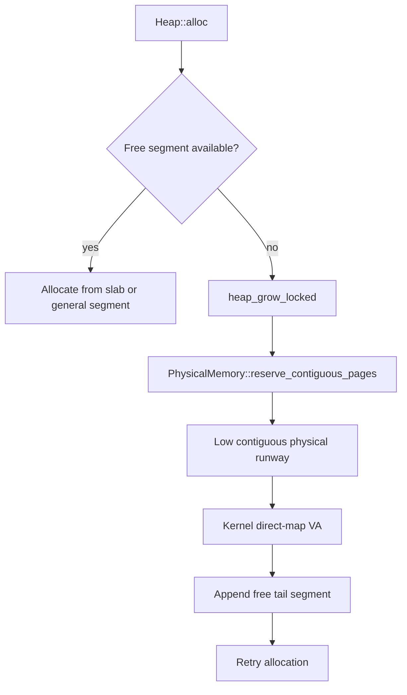
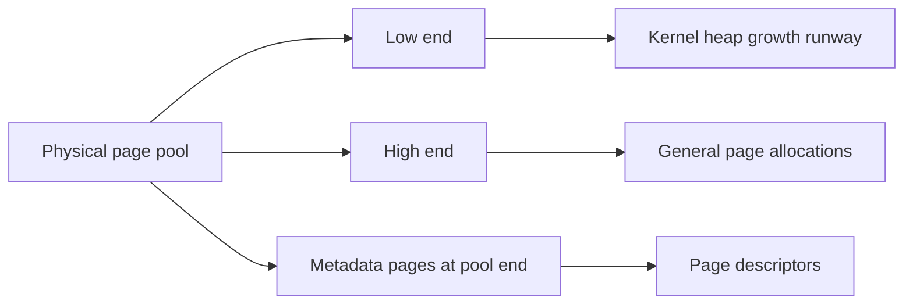
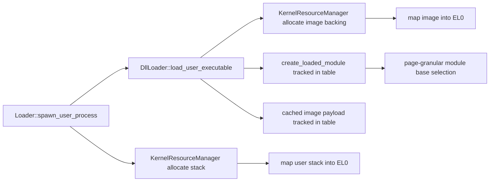
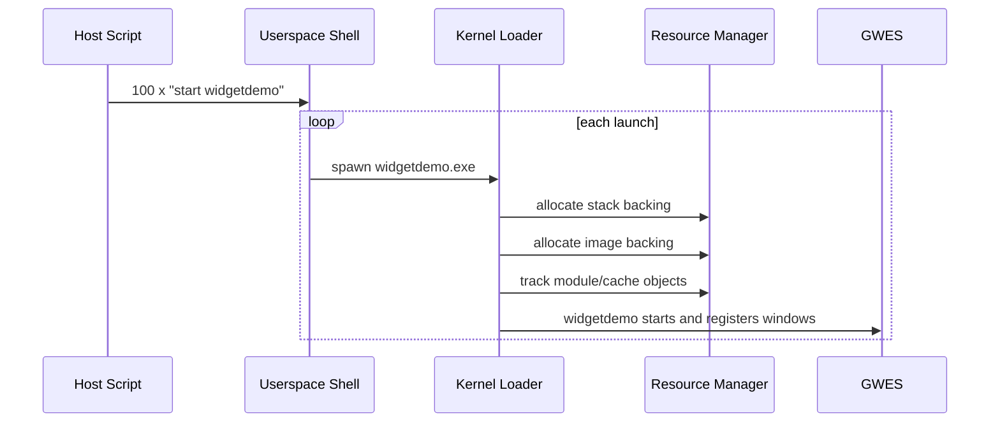

# Dynamic Kernel Heap and Loader Resource Manager

## Goal

This rewrite removes the fixed ceilings that previously blocked repeated GUI process launches:

- the kernel heap no longer ends at the initial early-heap carve-out
- loader stack backing no longer depends on a fixed six-slot pool
- DLL and EXE backing no longer depends on a fixed twenty-slot pool
- DLL module placement no longer depends on thirty-two 2 MiB slots
- the image cache no longer enforces a fixed global byte cap

The immediate target is stable repeated `widgetdemo` launches at `100` instances, with the next scale target being `1000+` once the rest of the GUI/runtime limits are widened.

## Heap growth model

The current kernel already has a higher-half direct map for physical memory. The heap rewrite uses that existing VM mapping instead of inventing a second kernel alias:

1. The physical-page metadata array now lives at the end of the physical page pool.
2. General page allocations now consume pages from the high end of the pool.
3. Kernel heap growth reserves pages from the low end of the pool in contiguous order.
4. Because those pages are already visible through the kernel direct map, the heap can append them directly to the arena and preserve the old `kernel_to_physical()` assumptions used by user-facing mappings.

For now, growth happens in `4 KiB` units.

The switch point for later work is the constant in `kernel/heap/heap.cpp`:

- `HeapGrowthPreferBlockMapping = false`
- `HeapGrowthUnitBytes = PageSize`

When the kernel is stable enough to move to block growth, that constant can become true and the contiguous reservation path can grow in `2 MiB` chunks instead.

## Heap flow

## Physical memory policy

## Loader resource manager

The new global resource manager lives in `kernel/resource_manager.cpp` and tracks these kinds:

- `LoaderStackBacking`
- `LoaderImageBacking`
- `LoaderModuleRecord`
- `LoaderImageCachePayload`
- `LoaderImageCacheRecord`

Each entry is dynamic and heap-backed. The table stores:

- resource kind
- address
- committed bytes
- owner id
- short label
- ownership flag for automatic release

The important change is not just statistics. The loader now allocates these resources on demand and registers them in one shared table, instead of pre-reserving separate fixed arrays and fixed byte caps per subsystem.

## Loader flow

## DLL placement change

Before this rewrite, DLL placement used `32` fixed `2 MiB` slots.

Now:

- the DLL region still starts at `3 * 2 MiB`
- the upper limit is the start of the GUI surface region at `64 * 2 MiB`
- placement is page-granular instead of slot-granular
- overlap is checked against each live module range inside the target process

This removes the previous artificial slot ceiling while keeping the region separated from later GUI/shared-memory ranges.

## Stress test path

The repeatable host-side stress runner is:

- `tools/run_widgetdemo_stress_headless.sh 100`

It sends `100` `start widgetdemo` commands into the existing headless QEMU shell path and writes the full output to `/tmp/widgetdemo_stress.log` by default.

## Stress sequence

## Debugging notes

When debugging growth failures, check these files first:

- `kernel/heap/heap.cpp`
- `kernel/mm/physical.cpp`
- `kernel/resource_manager.cpp`
- `kernel/loader/loader.cpp`
- `kernel/loader/dll_loader.cpp`

The most important behavioral invariant is still this:

- anything the loader later maps into EL0 must remain physically contiguous for the mapped byte range

That is why the kernel heap growth path preserves a contiguous low-page runway instead of switching the heap to arbitrary non-contiguous physical pages right now.