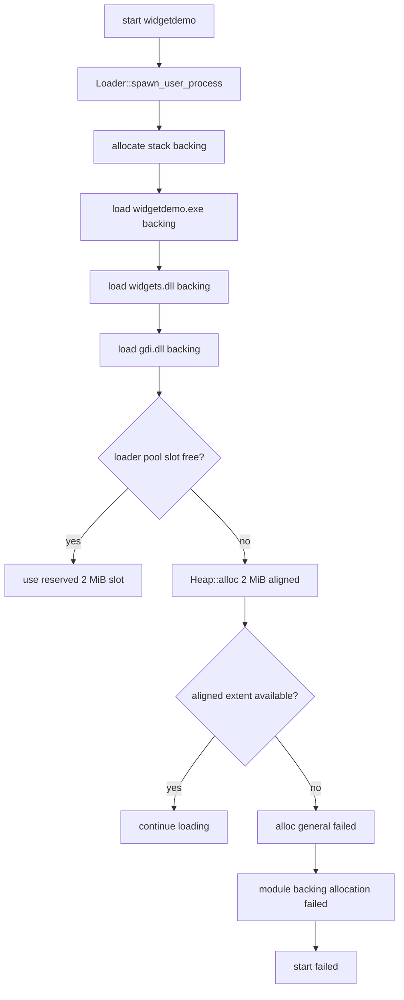
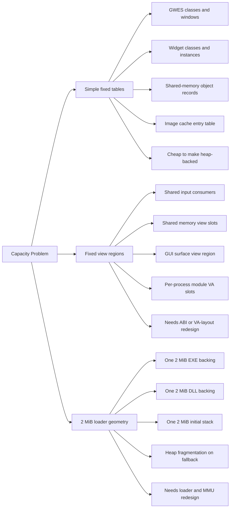

# Dynamic Scaling Analysis

This document explains which limits are still merely hardcoded tables, which
subsystems already moved to heap-backed registries, and which remaining limits
come from deeper loader/MMU design constraints.

## Current Finding

The current blocker is no longer GWES class/window tables or 2 MiB image
backing per EXE/DLL.

- GWES class and window registries are now heap-backed intrusive lists.
- `widgets.dll` class and instance registries are also heap-backed.
- Shared-memory objects and attachments are heap-backed registries.
- `dll_loader.cpp` now rounds image backing to page size and maps only the
  actual `image_bytes`, so typical EXEs and DLLs no longer charge one full
  dedicated 2 MiB physical block each.

The remaining scaling ceilings are concentrated in fixed virtual-address slot
regions and a smaller set of still-fixed process-local tables.

## Observed Failure Path

The key log sequence is:

- `widgetdemo.exe` executable backing succeeds
- `widgets.dll` backing succeeds
- `gdi.dll` backing requests another 2 MiB aligned slot
- `Heap::alloc(... size=2097152 align=2097152)` fails
- loader reports `module backing allocation failed: C:/lib/gdi.dll`

The resolved caller PC confirms the exact allocation site:

- `0xffff0000401296d8 -> allocate_loader_backing()`

## Why Earlier Failures Happened

The historical `widgetdemo` launch failures came from two older constraints:

- fixed GWES class/window tables
- fixed 2 MiB image backing allocations in the loader

Both of those have now been redesigned, so later scaling failures should be
interpreted through the new live counters rather than through the old
`four works, five fails` arithmetic.

## Mermaid: Fifth Launch Failure

## Capacity Inventory

The system currently mixes three kinds of limits:

1. Hardcoded tables that are easy to grow dynamically.
2. Fixed virtual address regions that are scalable only if the ABI/layout is redesigned.
3. Real memory geometry constraints caused by 2 MiB image slots.

### 1. Hardcoded tables that are easy to make dynamic

These are policy choices, not deep architectural requirements.

The most obvious ones have now already been converted. The remaining practical
work is less about obvious fixed tables and more about fixed virtual slot
regions and ABI-sized shared structures.

### 2. Fixed virtual regions that are only partially dynamic

These are backed by more serious layout assumptions.

- `applications/include/app/kernel_gui__.h`
  - `ROS_KERNEL_GUI_SHARED_INPUT_MAX_CONSUMERS = 8`
  - `ROS_KERNEL_GUI_SHARED_INPUT_CAPACITY = 64`
- `kernel/shared_memory.cpp`
  - `SharedMemoryViewSlotCount = 32`
  - shared-memory views still occupy one fixed 2 MiB user VA slot each
- `kernel/loader/dll_loader.cpp`
  - `UserModuleSlotCount = 32`
  - module region is fixed in user VA space
- `kernel/gui/gui_service.cpp`
  - `ROS_KERNEL_GUI_WINDOW_SURFACE_MAX_SLOTS = 2048`
  - `GuiSurfaceSlotUnitCount = 4096`

These already have some dynamic behavior internally, but they are still bounded
by fixed virtual layout regions or fixed ABI structs.

### 3. Real architectural scaling limits

These are the limits that matter for the fifth `widgetdemo`.

- `kernel/loader/dll_loader.cpp`
  - `LoaderBackingPoolSlotCount = 20`
- `kernel/loader/loader.cpp`
  - `LoaderStackPoolSlotCount = 6`
- `kernel/loader/loader.cpp`
  - user stack is still one 2 MiB region per process

These are not just arbitrary constants. They exist because the current loader
and MMU conventions still place images, stacks, and several shared regions on
L2-aligned user virtual boundaries even though the physical backing for images
and shared-memory payloads is now page-granular.

## Why The System Is Not Fully Dynamic Yet

There are good technical reasons the original code leaned on fixed capacities:

- Simpler cleanup paths.
  - A fixed array makes orphan cleanup and PID-based sweeping trivial.
- Predictable allocation behavior in early bring-up.
  - During boot and early userspace startup, fewer heap allocations reduce
    failure modes.
- Stable ABI-visible layouts.
  - Shared-input and shared-memory views embed fixed-size arrays directly in
    exported structs.
- Loader/MMU coupling.
  - The loader still treats an image as one relocatable 2 MiB object, which is
    much easier than page-granular file mapping plus per-page protections.

So the answer to “why not just scale dynamically?” is:

- For GWES and widgets class/window tables: this has already been done.
- For future loader or VA-space failures: dynamic tables alone do not solve it.

## Mermaid: Which Limits Are Easy vs Hard

## What Is Already Dynamic Today

Some important pieces are already better than before:

- `kernel/user_heap.cpp`
  - default user heap arena is now `256 KiB`, page rounded, and can grow
- `kernel/shared_memory.cpp`
  - physical backing is page-rounded to requested size instead of always 2 MiB
- `kernel/loader/dll_loader.cpp`
  - EXE and DLL physical backing is page-rounded to `image_size`, not a forced
    2 MiB block per image
  - image-cache entries are heap-backed instead of a fixed 32-entry table
- `kernel/gui/gui_service.cpp`
  - window surfaces use page-sized backing allocations internally, not a full
    2 MiB per control
- `applications/apps/gwes/gwes.c`
  - class and window registries are heap-backed and log live counts
- `applications/runtime/widget_support.c`
  - widget class and instance registries are heap-backed
- `applications/runtime/window_support.c`
  - class registrations, handle registrations, and the local message queue are
    heap-backed

This is why the system improved from earlier failures. The remaining wall is
much more concentrated in loader image backings.

## Root Cause Of The Next Likely Failures, In One Sentence

The next scaling failures are more likely to come from fixed virtual slot
regions, stack-pool exhaustion with heap fallback, or still-fixed process-local
client DLL tables than from old GWES or fixed-image-backing constraints.

## What Should Become Dynamic First

These changes are the most practical and lowest risk:

1. Keep adding live occupancy counters for loader pool, stack pool, shared-memory objects, and GWES records.
2. Revisit fixed VA-slot regions once the new counters show which one becomes the next wall.
3. Reduce ABI-visible fixed shared-input and shared-view limits only when the extra complexity is justified by real workloads.

These changes improve scale and debuggability, but they do not by themselves
remove fixed virtual-address layout ceilings.

## What Actually Fixes The Fifth Launch

The fifth-launch problem needs one of these architectural changes:

1. Share immutable module bytes across processes.
   - Keep one cached image copy and give each process only the writable relocation/IAT state it needs.
2. Split code and writable relocation state.
   - Read-only sections become shared; writable fixups become private.
3. Make the loader backing and stack pools adaptive.
   - This helps temporarily, but it still cannot beat underlying VA-layout constraints forever.

## Recommended Debug Instrumentation

To make future scaling failures obvious, add these counters to logs or a shell command:

- loader backing pool used / total
- stack pool used / total
- heap fallback allocation count
- shared-memory object count
- shared-memory attachment count
- GWES class count and window count
- GUI surface record count and slot-unit occupancy

## Practical Debug Checklist

When a new scaling failure appears, check in this order:

1. Did `window.dll` reject class registration, handle registration, or queueing because a fixed per-process table filled?
2. Did GUI surface creation fail because view slots or record slots filled?
3. Did shared-memory object or attachment counts spike unexpectedly?
4. Did the loader pool exhaust and fall back to the heap?
5. Did a 2 MiB aligned heap allocation fail during EXE/DLL/stack creation?
6. Did the per-process user module VA region run out of 32 slots?

## Bottom Line

Yes, parts of the system should scale dynamically instead of using hardcoded
capacities.

But the fifth `widgetdemo` failure is not primarily a hardcoded GWES-object
limit anymore. It is a loader-memory problem caused by the current design where
every loaded EXE and DLL still costs a dedicated 2 MiB backing block.

If the goal is to scale from four or five GUI apps to dozens, the decisive work
is in the loader and user mapping model, not only in replacing fixed arrays with
heap-backed containers.
