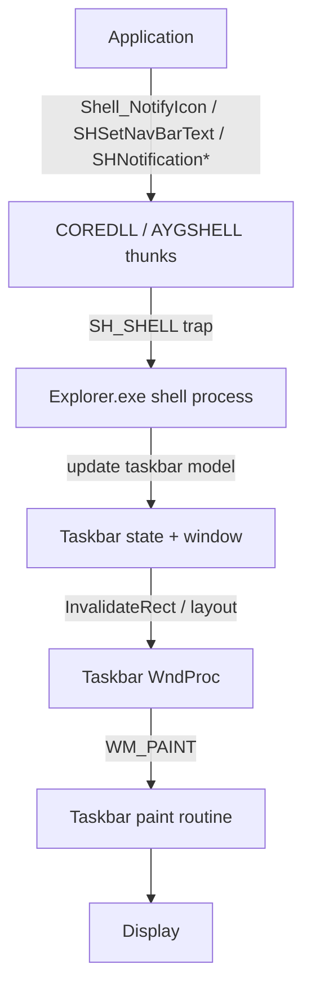
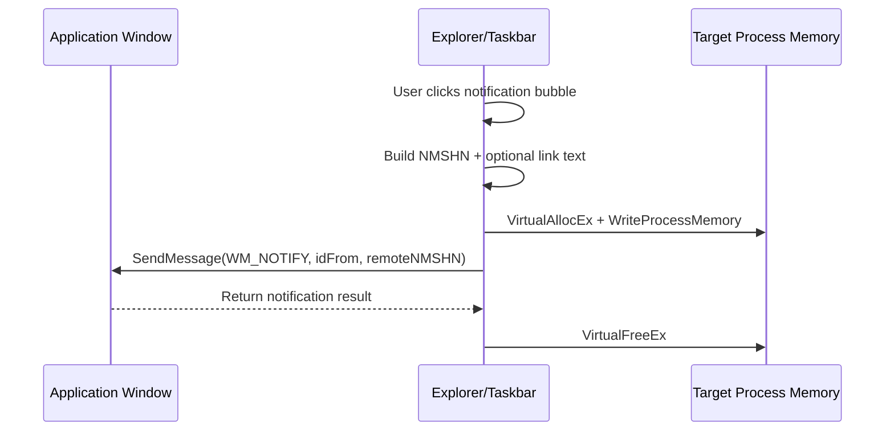
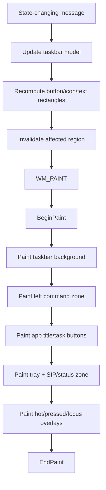

# Windows CE 7 Taskbar Behavior And WndProc Study

## Scope

This report is based on the `WINCE700` source tree currently in this workspace.

It focuses on:

1. What the CE7 source definitively shows about taskbar ownership, shell API routing, work-area management, tray/notification responsibilities, and shell behavior.
2. A reconstructed taskbar `WndProc` and paint model for hobby-OS design work, because the actual `explorer.exe` taskbar UI implementation is not present in this source subset.

That distinction matters.

## Important Source Boundary

The available CE7 source shows that:

- `explorer.exe` is the shell process that owns the shell API set and taskbar-facing behavior.
- Other components call into that shell through `SH_SHELL` APIs and AYGSHELL thunks.
- The taskbar registers itself with GWE through `RegisterTaskBar` / `RegisterTaskBarEx`.
- The shell process handles tray icons, navbar text, shell notifications, SIP/work-area interaction, and restart behavior.

But the actual Explorer UI code is not present here:

- There is no `explorer.cpp`, `taskbar.cpp`, `tray.cpp`, or similar taskbar window source file in the CE7 tree in this workspace.
- The direct implementation of `Taskbar_ChangeItemText` is declared but not defined in the available sources.
- The real taskbar window class / actual `WndProc` / `WM_PAINT` handler is therefore not directly inspectable from this tree.

So this report has two evidence levels:

- `Proven from source`
- `Reconstructed from source contracts`

I keep those separate below.

## Files Examined

- `WINCE700/private/shell/shellpsl/haveaygshell/api.cpp`
- `WINCE700/private/shell/shellpsl/haveaygshell/shellpsl.cpp`
- `WINCE700/private/winceos/COREOS/core/thunks/tshellap.c`
- `WINCE700/private/winceos/COREOS/core/thunks/twinuser.cpp`
- `WINCE700/private/test/gwes/gdi/gdit/main.cpp`
- `WINCE700/private/test/shell/XamlRuntime/perf/scenarios/AppLoadTest/apploadtest.cpp`

## 1. What CE7 Source Proves

### 1.1 Explorer owns the shell API set

`WINCE700/private/shell/shellpsl/haveaygshell/api.cpp` is effectively the shell-side API table for Explorer.

The file comment even notes it used to be `explorer.cpp` (`api.cpp:13-15`), which is a strong clue that this DLL/API layer is tightly coupled to the shell process.

The API set includes entries for:

- `Shell_NotifyIconI`
- `SHCreateExplorerInstance`
- `SHCloseAppsI`
- `SHSetNavBarText`
- `SHNotificationAddII`
- `SHNotificationUpdateII`
- `SHNotificationRemoveII`
- `SHNotificationGetDataII`

See:

- `api.cpp:29-36`
- `api.cpp:60-137`
- `api.cpp:140-215`

That proves the Explorer-side shell owns:

- tray icon state
- Explorer process creation / restart
- notification storage and routing
- navbar text updates
- shell-level close-apps behavior

### 1.2 COREDLL does not implement the taskbar itself

`WINCE700/private/winceos/COREOS/core/thunks/tshellap.c` shows the public exports in COREDLL are only thunks into the shell API set.

Relevant entries:

- `xxx_Shell_NotifyIcon` -> `Shell_NotifyIcon(...)` (`tshellap.c:87-94`)
- `xxx_SHCreateExplorerInstance` -> `SHCreateExplorerInstance(...)` (`tshellap.c:97-103`)
- `xxx_SHDoneButton` -> `SHDoneButton_Trap(...)` (`tshellap.c:116-126`)
- `xxx_SHSetNavBarText` -> `SHSetNavBarText_Trap(...)` (`tshellap.c:152-162`)
- `xxx_SHCloseApps` -> `SHCloseApps_Trap(...)` (`tshellap.c:176-186`)
- `xxx_SHNotificationAdd/Update/Remove/GetData` -> shell traps (`tshellap.c:189-260`)

This means:

- applications do not talk directly to the taskbar window
- they call COREDLL / AYGSHELL APIs
- those APIs route into the Explorer shell process

Architecturally, the taskbar is not a kernel or GWE component. It is a user-mode shell component that sits on top of GWE.

### 1.3 The taskbar window registers with GWE

`WINCE700/private/winceos/COREOS/core/thunks/twinuser.cpp` exposes:

- `RegisterTaskBar(HWND hwndTaskBar)` (`twinuser.cpp:2659-2665`)
- `RegisterTaskBarEx(HWND hwndTaskBar, BOOL bTaskBarOnTop)` (`twinuser.cpp:2667-2674`)

That proves the shell taskbar window participates in a special GWE registration path.

What that implies:

- the shell tells GWE which window is “the taskbar”
- GWE can then honor shell/taskbar semantics such as work-area coordination, z-order policy, and full-screen show/hide integration

### 1.4 The taskbar process restarts Explorer

`ShellNotifyCallback` in `api.cpp` reacts to process detach and re-launches `explorer.exe`:

- memory-low path compacts heaps (`api.cpp:249-257`)
- process detach path closes the API set, clears taskbar registration, and creates `explorer.exe` again (`api.cpp:258-267`)

That proves:

- Explorer is expected to be restartable
- taskbar registration is part of shell lifetime management
- the taskbar is not just a passive window; it is the shell’s central service endpoint

### 1.5 Navbar text is taskbar-owned UI state

In `shellpsl.cpp`, `SHSetNavBarText(HWND hwnd, LPCTSTR pszText)` validates the target app window and then calls:

- `Taskbar_ChangeItemText(hwnd, pszText)` (`shellpsl.cpp:139-158`)

The implementation is missing, but the interface proves:

- the taskbar tracks app/window-associated caption text
- the taskbar owns the visual text shown in its navigation/title area
- the change is window-targeted, not global

For a hobby OS design, this is a very useful clue: CE-style taskbars are not just button strips. They also expose current app title/navigation text as taskbar-owned UI.

### 1.6 Bubble notifications are marshalled into app process space and delivered by `WM_NOTIFY`

`SendBubbleNotificationMessage` in `shellpsl.cpp`:

- locates the target process from an HWND (`shellpsl.cpp:49-54`)
- marshals an `NMSHN` structure plus optional link text (`shellpsl.cpp:56-103`)
- allocates memory in the target process (`shellpsl.cpp:104-117`)
- sends `WM_NOTIFY` to the app window (`shellpsl.cpp:113-116`)

This proves:

- shell notifications/bubbles are taskbar-managed UI
- click/selection callbacks from shell UI are delivered back to apps through a window-message callback path
- the taskbar is acting as a UI broker between global shell state and app-local windows

### 1.7 The shell owns work-area and SIP cooperation

`NotSystemParametersInfo` in `shellpsl.cpp` handles shell-specific SPI requests, including:

- `SPI_GETWORKAREA` (`shellpsl.cpp:180-186`)
- `SPI_SETSIPINFO` (`shellpsl.cpp:188-217`)
- `SPI_GETSIPINFO` (`shellpsl.cpp:219-256`)

When `SPI_GETSIPINFO` fails to retrieve full SIP state, it falls back to:

- filling `rcVisibleDesktop` from `SPI_GETWORKAREA`
- marking the SIP as docked (`shellpsl.cpp:242-246`)

That proves the shell/taskbar is deeply involved in:

- visible desktop/work-area calculation
- SIP docking and reserved-screen-space behavior
- “desktop minus taskbar minus SIP” geometry

### 1.8 Full-screen apps are expected to hide/show the taskbar

The CE7 test code in `gdit/main.cpp` carries the common `SHFullScreen` taskbar flags:

- `SHFS_SHOWTASKBAR = 0x0001`
- `SHFS_HIDETASKBAR = 0x0002`
- `SHFS_SHOWSIPBUTTON = 0x0004`
- `SHFS_HIDESIPBUTTON = 0x0008`

See `gdit/main.cpp:19-30`.

The same file shows applications calling `SHFullScreen(hwnd, SHFS_HIDETASKBAR)` and later restoring with `SHFS_SHOWTASKBAR` (`gdit/main.cpp:1688-1735`).

That proves:

- the taskbar is expected to dynamically hide/show
- full-screen mode is part of the shell/taskbar contract
- the taskbar must support geometry changes without breaking the desktop/work area

### 1.9 XRShell uses a top-level Explorer/desktop window

The XAML test code looks for:

- class name `DesktopExplorerWindow`
- window text `XRShell`

See `apploadtest.cpp:44-66`.

That proves there is at least one CE7 shell variant where the desktop shell is a top-level Explorer-owned window with a recognizable desktop window identity.

It does not directly expose the taskbar `WndProc`, but it confirms the desktop/taskbar live inside a normal shell windowing model.

## 2. What Is Missing

The source tree does **not** include:

- the actual taskbar window class registration
- the actual taskbar `WndProc`
- the actual taskbar `WM_PAINT` implementation
- the actual `Taskbar_ChangeItemText` body
- the actual tray layout / button layout / draw helpers
- the actual child-window composition of the taskbar

So an honest statement is:

- I cannot document the real CE7 taskbar paint routine line-by-line from this tree.
- I can document the behavior boundary and reconstruct a high-confidence design model for a CE-style taskbar.

## 3. Evidence-Based Taskbar Responsibility Model

Based on the available CE7 code, the taskbar process is responsible for at least these behaviors:

1. Register itself as the official taskbar window with GWE.
2. Maintain work-area geometry.
3. Cooperate with the SIP and visible desktop rectangle.
4. Accept tray icon add/modify/delete operations.
5. Accept shell notification add/update/remove/get-data operations.
6. Maintain app-associated navbar/task text.
7. Deliver shell bubble callbacks back to applications through `WM_NOTIFY`.
8. Hide/show itself for full-screen modes.
9. Participate in Explorer process restart and shell service availability.

That is enough to reconstruct a plausible CE-style taskbar architecture for your OS.

## 4. Reconstructed CE-Style Taskbar Architecture

This section is reconstruction, not direct source recovery.

### 4.1 Likely internal state

A CE-style taskbar almost certainly needs state like:

- taskbar orientation: top or bottom
- taskbar rectangle and client rectangle
- work-area rectangle
- shell metrics:
  - taskbar height
  - start button width
  - tray width
  - padding
  - icon size
- button collections:
  - app buttons / active app entry
  - tray icons
  - notification items
- current navbar/title text
- SIP button visibility
- done/back button visibility
- pressed / hot / tracking state
- full-screen hidden flag
- paint invalidation flags
- theme/brush/font resources

### 4.2 Likely child regions

A CE-style taskbar is usually conceptually split into zones:

- left command zone:
  - Start / menu / home button
  - Done / back button depending on shell mode
- middle zone:
  - current app title or active task buttons
- right zone:
  - notification icons
  - SIP button
  - status widgets

Even if it is all painted by one parent window, the geometry logic almost always follows that split.

## 5. Reconstructed Message Flow

### 5.1 System-level flow

### 5.2 Bubble notification callback flow

This matches `SendBubbleNotificationMessage` in the source.

### 5.3 Taskbar layout and paint flow

## 6. Reconstructed WndProc Behavior

This section is the best model for the actual `WndProc`, given the shell contract present in CE7.

### 6.1 `WM_CREATE`

Expected responsibilities:

- initialize fonts, brushes, pens, metrics
- create or initialize internal taskbar model
- determine top/bottom docking mode
- register with GWE using `RegisterTaskBar` or `RegisterTaskBarEx`
- query screen metrics
- compute initial work area
- query SIP state if supported
- initialize tray/notification stores
- possibly register for shell services / notification queues

### 6.2 `WM_SIZE`

Expected responsibilities:

- recompute all child rectangles
- update reserved work-area geometry
- invalidate the whole bar or changed subregions

### 6.3 Shell API driven updates

These are not literal `WM_*` names in the source we have, but proven API inputs:

- tray icon add/modify/delete
- shell notification add/update/remove/get-data
- navbar text updates
- full-screen hide/show
- app key association changes
- close-apps requests

Expected `WndProc` behavior after each:

- mutate state
- recompute layout if item count or caption width changed
- invalidate only the affected region when possible

### 6.4 `WM_SETTINGCHANGE` / shell metric changes

Expected responsibilities:

- refresh colors/fonts/sizes
- refresh work area
- refresh SIP geometry assumptions
- rebuild layout
- repaint

### 6.5 `WM_NOTIFY`

Two different roles are likely:

- inbound shell control notifications from taskbar child controls
- outbound delivery target for bubble callbacks into app windows

For your own OS, this is a strong design pattern:

- use one internal notification path for taskbar child components
- use one app-facing callback path for shell-owned transient UI

### 6.6 Pointer and pen messages

Likely handled messages:

- `WM_LBUTTONDOWN`
- `WM_LBUTTONUP`
- `WM_MOUSEMOVE`
- `WM_CANCELMODE`
- possibly stylus/gesture variants

Expected behavior:

- hit test current point against start button, task buttons, tray icons, SIP button
- update hot/pressed state
- capture mouse/stylus if dragging or pressing
- invoke action on release if still over the same target

### 6.7 `WM_PAINT`

The exact source is missing, but the paint order is highly likely to be:

1. Fill bar background.
2. Paint border/separator edge.
3. Paint left command region.
4. Paint active app title or task buttons.
5. Paint tray/status icons.
6. Paint SIP or other shell buttons.
7. Paint pressed/hot/focus overlays.

That ordering minimizes overdraw bugs and ensures icons/text sit on top of the background and frame elements.

## 7. Reconstructed Paint Model In Detail

### 7.1 Why the paint model almost has to be segmented

Because the CE7 taskbar contract combines:

- app caption text (`SHSetNavBarText`)
- tray icons (`Shell_NotifyIcon`)
- shell notifications (`SHNotification*`)
- SIP/taskbar visibility interaction (`SPI_GETWORKAREA`, SIP info, `SHFullScreen`)

the paint routine cannot be a single flat “draw caption” path. It needs independent sub-layout for:

- changing title width
- varying tray icon count
- optional notification indicator
- optional SIP button
- optional done/start button

So a segmented layout model is the only realistic implementation.

### 7.2 Likely background painting

Expected steps:

- get invalid rect
- select base background brush
- fill the dirty area
- draw top or bottom border highlight/shadow line depending on docking edge
- possibly draw a gradient or themed band fill if skinning is active

For a hobby OS, a flat fill plus a 1-pixel edge is enough to start.

### 7.3 Likely command button painting

Each command element probably follows:

- choose rect
- choose visual state:
  - normal
  - hot
  - pressed
  - disabled
- draw button frame
- draw icon and/or text centered within content bounds

The important design insight:

- button visuals should be state-driven by model data
- `WM_PAINT` should not decide behavior, only render current state

### 7.4 Likely title/task region painting

Since `SHSetNavBarText(hwnd, text)` targets a specific app window, the taskbar likely maintains some mapping:

- app HWND -> taskbar item
- current foreground HWND -> highlighted taskbar item / caption source

When painting:

- locate active item
- decide whether to draw a single title string or multiple task buttons
- clip text to the center region
- reserve space for right tray area first, then ellipsize title text

### 7.5 Likely tray painting

Because Explorer exports `Shell_NotifyIconI`, the taskbar almost certainly stores a list of tray icon records containing at least:

- owner window
- callback message
- icon handle
- tooltip/text
- visibility/state flags

Paint path:

- compute tray strip from right edge inward
- allocate fixed icon slots or compact icon packing
- draw each visible icon centered in its slot
- draw separator from center/title region if needed

### 7.6 Likely invalidation policy

Efficient taskbars do not repaint everything for every change.

Reasonable CE-style invalidation rules:

- navbar text change -> invalidate title region only
- single icon modify -> invalidate that icon slot only
- icon add/remove -> invalidate tray strip and maybe title strip
- full theme/metric change -> invalidate entire taskbar
- press/hot-state change -> invalidate old and new hot rects

This is important if you want your own implementation to feel responsive on low-end hardware.

## 8. Practical Design Conclusions For Your OS

### 8.1 Separate model from paint

Best approach:

- keep a `TaskbarState`
- mutate it from shell events and window events
- compute geometry in a separate layout pass
- let `WM_PAINT` only read state and draw

Do not bury layout decisions directly inside every event branch.

### 8.2 Treat the taskbar as a shell service, not just a window

CE7’s source strongly implies the taskbar is both:

- a visible bar
- a service endpoint for tray icons, shell notifications, app caption updates, work-area calculation, and full-screen mode

That is the right mental model for your hobby OS.

### 8.3 Keep work-area ownership centralized

One of the cleanest CE ideas is:

- the taskbar is the authority on reserved desktop space
- full-screen apps request hide/show rather than just overlapping it arbitrarily

That simplifies desktop behavior a lot.

### 8.4 Keep bubble/notification callbacks out of paint code

CE7’s `SendBubbleNotificationMessage` shows a clean split:

- taskbar owns global UI
- applications receive callbacks through messages
- process marshalling is separate from rendering

That separation is worth copying even in a hobby OS.

## 9. Recommended Hobby-OS Taskbar Layout

If your goal is understanding rather than CE compatibility, start with this simplified structure:

- `TaskbarWindow`
  - owns full bar rect
  - owns paint + hit testing
- `TaskbarState`
  - list of running tasks
  - active task
  - navbar text
  - list of tray icons
  - visibility flags for taskbar/SIP/notification area
- `ShellRouter`
  - receives app requests like add tray icon, set task text, close apps
  - mutates `TaskbarState`
  - triggers layout + repaint

## 10. Summary

### What can be proven from this CE7 tree

- Explorer owns the shell API set and restarts `explorer.exe`.
- The shell exposes tray icon, shell notification, navbar text, and close-app behavior through shell APIs.
- The taskbar registers itself with GWE through `RegisterTaskBar` / `RegisterTaskBarEx`.
- The shell cooperates with work-area and SIP geometry.
- Full-screen apps are expected to hide/show the taskbar through shell APIs.
- Bubble notifications callback into apps via `WM_NOTIFY` and marshalled `NMSHN`.

### What cannot be proven from this CE7 tree

- the exact taskbar `WndProc`
- the exact `WM_PAINT` handler
- the exact internal taskbar data structures
- the exact visual layout and child-window composition

### Best design takeaway

The CE7 taskbar is best understood as a shell-owned service window with three coupled jobs:

1. reserve and manage desktop edge space
2. provide global shell UI
3. broker app-to-shell UI integration

That is the right base model for your own implementation.

