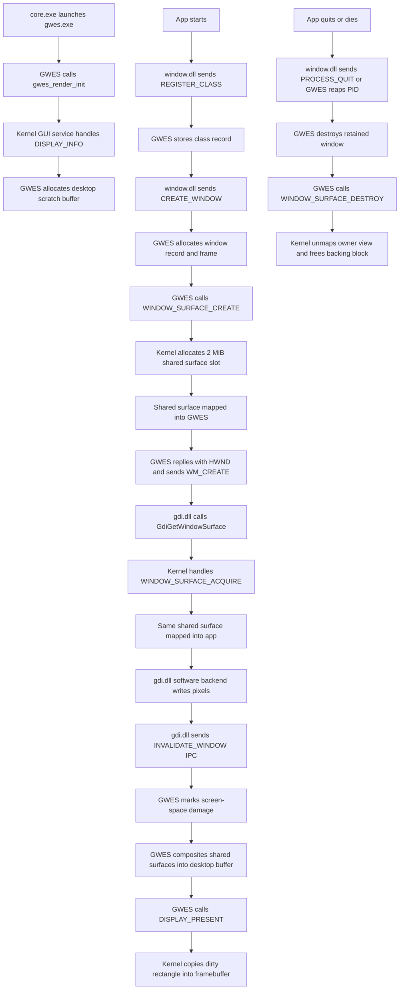

# GDI, GWES, and Shared Surface Architecture

## Purpose

This document describes the current GUI split after moving drawing ownership out of the window helper and into `gdi.dll`.

The target shape is:

- `window.dll` owns client-side message-loop helpers and window-class registration.
- `gwes.exe` owns window lifetime, retained window metadata, dirty tracking, and desktop composition.
- `gdi.dll` owns drawing APIs and the active rendering backend.
- The kernel GUI service owns framebuffer presentation and shared window-surface mappings.

This split keeps GWES out of primitive rasterization and makes future rendering backends possible without changing the window server contract.

## Ownership Model

### window.dll

- Registers classes in the local process.
- Sends `REGISTER_CLASS` and `CREATE_WINDOW` IPC packets to GWES.
- Keeps the local message queue and Win32-style `GetMessage` / `DispatchMessage` behavior.
- Sends `PROCESS_QUIT` to GWES during `PostQuitMessage`.

### gwes.exe

- Accepts class and window creation requests.
- Assigns stable `HWND` values.
- Creates one shared surface per window through `SYS_GUI_CONTROL`.
- Maps that surface into GWES so the compositor can read it.
- Tracks dirty regions for each window.
- Composites dirty regions onto the desktop scratch buffer.
- Presents desktop damage to the framebuffer through `DISPLAY_PRESENT`.

GWES does **not** draw rectangles, lines, fills, or other app content anymore.

### gdi.dll

- Acquires a mapped surface view for a given `HWND`.
- Exposes a public drawing interface:
  - `GdiGetWindowSurface`
  - `GdiReleaseWindowSurface`
  - `GdiFillSurfaceRect`
  - `GdiInvalidateRect`
  - `GdiFillRect`
- Uses the software backend today.
- Can later swap to another backend without changing the app-visible API.

### Kernel GUI Service

- Returns framebuffer geometry through `DISPLAY_INFO`.
- Copies dirty desktop rectangles into the framebuffer through `DISPLAY_PRESENT`.
- Creates and maps shared window surfaces through:
  - `WINDOW_SURFACE_CREATE`
  - `WINDOW_SURFACE_DESTROY`
  - `WINDOW_SURFACE_ACQUIRE`
  - `WINDOW_SURFACE_RELEASE`

## Data Flow

### Window Creation

1. App calls `CreateWindowClass` in `window.dll`.
2. `window.dll` mirrors the registration to GWES.
3. App calls `CreateWindow`.
4. GWES allocates a server window record and chooses a default frame.
5. GWES asks the kernel GUI service to create a shared surface for that `HWND` and owner PID.
6. Kernel maps the new shared surface into GWES and returns a `RosKernelGuiWindowSurfaceView`.
7. GWES stores the mapped view in its retained window record.
8. GWES replies to the app with the new `HWND` and sends `WM_CREATE`.

### Drawing

1. App calls `GdiGetWindowSurface(hwnd, &surface)`.
2. `gdi.dll` asks the kernel GUI service to acquire the shared surface view for the current owner process.
3. Kernel maps the same backing block into the app process.
4. `gdi.dll` returns a `RosGdiSurface` with a stable pixel pointer.
5. The software backend writes pixels directly into that mapped surface.
6. App or helper calls `GdiInvalidateRect`.
7. `gdi.dll` sends `INVALIDATE_WINDOW` IPC to GWES.
8. GWES marks the corresponding screen-space rectangle dirty.

### Composition and Present

1. GWES wakes in its poll loop.
2. GWES walks pending damage rectangles.
3. GWES clears the desktop scratch buffer for the dirty area.
4. GWES copies pixels from each visible shared window surface into the desktop buffer.
5. GWES calls `DISPLAY_PRESENT` for the dirty rectangle.
6. Kernel copies that rectangle into the framebuffer device.

### Cleanup

1. App posts `WM_QUIT` or exits unexpectedly.
2. `window.dll` sends `PROCESS_QUIT`, or GWES later reaps the dead PID.
3. GWES destroys each retained window.
4. GWES calls `WINDOW_SURFACE_DESTROY` for each `HWND`.
5. Kernel unmaps the owner-side shared view if it is still alive and frees the backing block.

## Debugging Notes

### Common Responsibility Check

- If a bug is about message ordering, class registration, or local queue behavior, start in `window.dll`.
- If a bug is about `HWND` ownership, dirty regions, composition, or window cleanup, start in GWES.
- If a bug is about fill logic, pixel writes, clipping, or backend behavior, start in `gdi.dll`.
- If a bug is about missing mappings, framebuffer present, or display geometry, start in the kernel GUI service.

### Important Constraints

- The current MMU path maps only full L2 blocks into EL0 address spaces.
- Each shared window surface therefore consumes one 2 MiB mapping slot today.
- That is intentionally simple for now and should be revisited if window count or surface sizes grow.

### Failure Signatures

- `gwes.exe: render init failed; running without display output`
  - `DISPLAY_INFO` failed.
  - Check the kernel `SYS_GUI_CONTROL` handler and framebuffer device registration.
- `CreateWindow` fails with `HWND == 0`
  - GWES probably failed `WINDOW_SURFACE_CREATE` or ran out of window slots.
- `GdiGetWindowSurface` fails
  - The owner process probably could not acquire the shared view.
  - Check `WINDOW_SURFACE_ACQUIRE` and the owner PID stored by GWES.
- Drawing succeeds in memory but nothing appears on screen
  - The dirty rectangle may not be sent.
  - Check `INVALIDATE_WINDOW`, GWES dirty tracking, and `DISPLAY_PRESENT`.
- Window content is stale after process exit
  - Check the GWES reap path and `WINDOW_SURFACE_DESTROY` cleanup.

## Flow Chart

## Future Expansion

- Add more GDI backends behind the same `RosGdiSurface` contract.
- Add richer primitives in `gdi.dll` without changing GWES.
- Replace the current 2 MiB fixed-slot mapping with finer-grained shared mappings once the MMU layer supports them cleanly.
- Add explicit resize and surface reallocation flow when window sizing becomes dynamic.