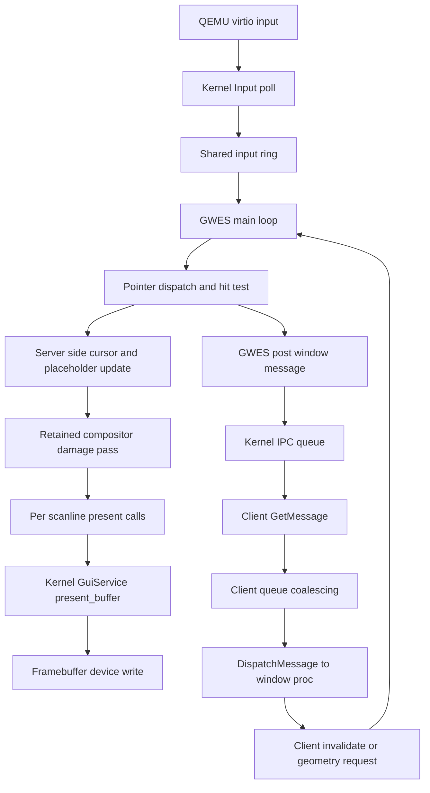
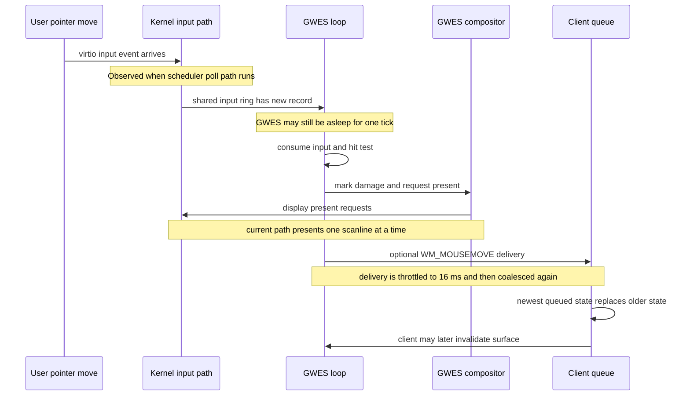

# GWES Latency Analysis

## Executive Summary

The remaining lag is not coming from one place. The current system stacks several medium-cost delays on top of each other:

1. GWES runs as a polling reactor, not as an event-driven server.
2. GWES asks to sleep for `1 ms` when busy and `8 ms` when idle, but user sleep is rounded to the kernel tick, which is currently `10 ms`.
3. The compositor still presents one scanline at a time even though the kernel display-present ABI accepts multi-row rectangles.
4. `WM_MOUSEMOVE` is additionally throttled to `16 ms` before it even crosses from GWES to the client queue.
5. The scheduler/timer path is still cooperative-polled on `virt`, so wakeups are coarser than the constants in userspace suggest.

The important missed detail is that `GWES_BUSY_POLL_MSEC = 1` does **not** currently mean a 1 ms wake cadence in practice. With the current kernel sleep conversion, both the `1 ms` and `8 ms` sleeps collapse onto the same 10 ms tick domain.

That means there are two different lag classes:

- Cursor and placeholder drag lag are mostly server-side and render-side.
- Widget hover or client reaction lag adds another application-message throttle layer.

## Current Timing Facts

- Board timer interval: `10,000 us` per tick.
- Effective scheduler tick: `10 ms` or `100 Hz`.
- Kernel sleep conversion: user `sleepMs()` rounds up to whole 10 ms ticks.
- GWES busy sleep request: `1 ms`, but effectively one tick.
- GWES idle sleep request: `8 ms`, but effectively one tick.
- GWES `WM_MOUSEMOVE` cross-process throttle: `16 ms`.

## Window Server And Message Architecture

### What This Means

- Cursor movement and placeholder move/resize do **not** need client repaint work to look smooth.
- If cursor and placeholder are already laggy, the dominant bottleneck is upstream of the application: input poll cadence, GWES wake cadence, composition cost, and present cost.
- Client queue coalescing helps avoid backlog, but it does not solve server wake or render latency.

## End To End Latency Timeline

## Calculated Lag Budget

These are not hard real-time guarantees. They are the major coarse delays already visible in the code.

### 1. Cursor And Placeholder Path

This path is the most important because it bypasses client logic.

$$
L_{cursor} \approx L_{input\ poll} + L_{GWES\ wake} + L_{compose} + L_{present}
$$

Where:

- $L_{input\ poll}$ is governed by the cooperative scheduler poll path and the board timer domain.
- $L_{GWES\ wake}$ is currently quantized by `sleepMs()` into 10 ms ticks.
- $L_{compose}$ depends on damage size and the number of visible windows.
- $L_{present}$ is amplified by the scanline-at-a-time present loop.

Practical conclusion:

- Even before counting composition cost, the coarse wake path can already inject roughly one tick of delay.
- Because the compositor then emits many present calls for large dirty rectangles, render time can add another visible chunk of latency on top.

### 2. Client Mouse Reaction Path

This is the path for hover state, client-side drag feedback, or widget logic.

$$
L_{client\ mousemove} \approx L_{cursor} + L_{GWES\ mousemove\ throttle} + L_{client\ dispatch}
$$

Where:

- $L_{GWES\ mousemove\ throttle}$ is up to `16 ms` by design.
- `window_support.c` then coalesces `WM_MOUSEMOVE`, `WM_PAINT`, `WM_TIMER`, `WM_MOVE`, and `WM_SIZE` again.

Practical conclusion:

- Client input handling can easily feel slower than cursor motion.
- But since the user also reports laggy cursor and laggy move placeholder, the client queue is not the first-order root cause.

## Ranked Likely Causes

### 1. GWES Sleep Requests Are Rounded To 10 ms

GWES ends every loop iteration with:

- busy: `sleepMs(1)`
- idle: `sleepMs(8)`

The kernel sleep path converts milliseconds into whole scheduler ticks, and the tick constant is currently 10 ms. So GWES is not waking at 1 ms granularity. This is one of the biggest missed assumptions in the current tuning work.

Why it matters:

- New input arriving just after GWES goes to sleep can wait roughly a tick before GWES notices it.
- This directly affects cursor responsiveness and placeholder drag smoothness.

### 2. The Compositor Still Presents One Scanline At A Time

`window.cpp` composes damage row by row and calls the GUI present syscall with `height = 1` for each emitted row chunk.

Why it matters:

- Large dirty rectangles become many kernel crossings and many framebuffer writes.
- Full-window drag, resize preview, or large cursor damage quickly multiplies the fixed per-call cost.
- The kernel present path already accepts multi-row rectangles, so this is avoidable overhead.

### 3. `WM_MOUSEMOVE` Is Dropped At 16 ms Intervals Before Client Delivery

GWES throttles `WM_MOUSEMOVE` before it crosses the IPC boundary.

Why it matters:

- Client widgets see at most about $\frac{1000}{16} \approx 62.5$ updates per second.
- The implementation drops intermediate moves rather than preserving a pending latest move for later delivery.
- This affects app-side feel, but it does not explain laggy cursor or laggy move placeholder by itself.

### 4. The Scheduler And Timer Model Are Still Cooperative On `virt`

The `virt` board uses a polled periodic timer model. Scheduler time advances when the architecture counter is checked at cooperative poll sites.

Why it matters:

- This is not yet a strong event-driven wake model for GUI workloads.
- Input arrival, sleep expiry, and reschedule timing remain coarser than a preemptive periodic timer design.

### 5. Message Queue Coalescing Helps Throughput But Masks Perceived Latency

Client-side coalescing is correct for burst tolerance, but it trades intermediate states for the newest state.

Why it matters:

- It prevents queue explosion.
- It does not reduce the time to first visible response.
- It can make the system look like it “jumps” between newer states rather than tracking continuously.

## What We Likely Missed Earlier

The biggest missed item is this:

> We tuned GWES as if `1 ms` and `8 ms` sleeps were real, but the kernel currently services them on a `10 ms` tick domain.

That makes several earlier tuning constants look more precise than they really are.

Secondary missed item:

> The slow move placeholder proves the application is not the limiting stage for drag smoothness.

That shifts the focus away from client message semantics and onto:

- wake cadence
- render cadence
- present batching

## How Long Is The System Timer Tick?

Right now it is:

$$
10{,}000\ \mu s = 10\ ms = 100\ Hz
$$

The current code expresses that in two places:

- board timer interval as `10000ULL`
- kernel time conversions as `10ULL` milliseconds per tick

## Can We Decrease It So It Ticks Faster?

Yes, but not safely as a one-line tweak.

### What Would Help

Reducing the tick to `5 ms` or `1 ms` would improve:

- `sleepMs()` granularity
- uptime precision
- timer-based wake latency

### What Must Change Together

If we change the board timer interval, we also need to update or centralize every place that assumes 10 ms ticks:

- `kernel/include/platform/board/virt/platform_backend.h`
- `kernel/include/platform/board/raspi3/platform_backend.h`
- `kernel/service/service_call.cpp`
- `kernel/kernel_event.cpp`
- `kernel/gui/gui_service.cpp`

Otherwise:

- uptime becomes wrong
- sleeps become shorter or longer than requested
- event timestamps become inconsistent

### Would Faster Ticks Alone Fix The Lag?

No.

It would help the coarse wake side, but it would not fix:

- per-scanline present overhead
- the 16 ms `WM_MOUSEMOVE` throttle
- the fact that GWES still uses a polling loop instead of a true event-driven wait path

## Recommended Order Of Attack

1. Batch display present calls into multi-row rectangles.
2. Eliminate the fake 1 ms assumption by either reducing tick size safely or replacing GWES sleep/poll with a proper waitable wake path.
3. Revisit `WM_MOUSEMOVE` throttling only after cursor and placeholder motion are smooth.
4. Derive tick milliseconds from one shared kernel source instead of repeating `10ULL` in multiple subsystems.

## Bottom Line

The current lag is consistent with a server that wakes on a 10 ms sleep domain, composites on the CPU, and then presents one scanline at a time. The most important previously-missed detail is that the GWES sleep constants are finer than the kernel actually honors.