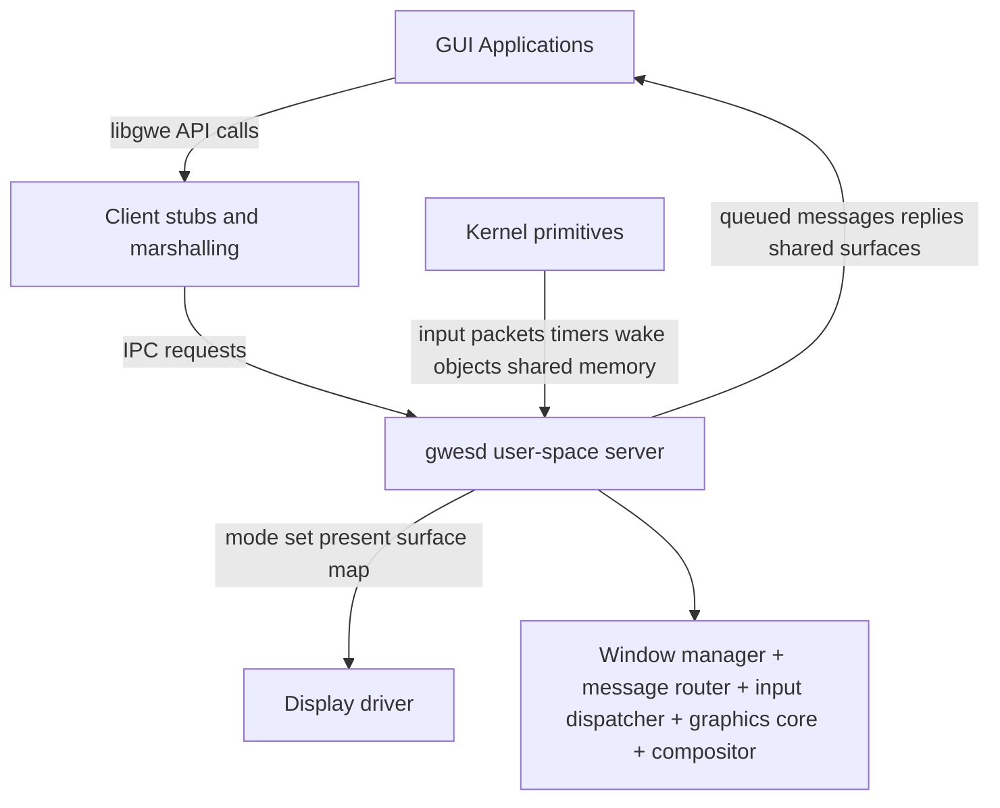
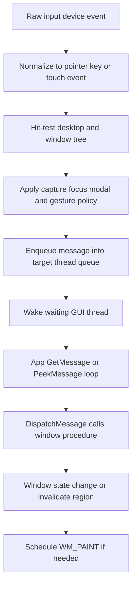
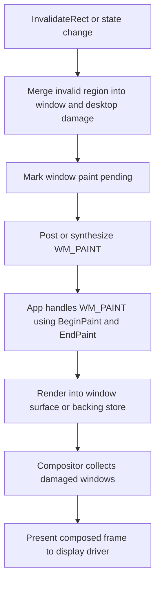

# Windows CE 7 And Windows CE 8 GWES Architecture And Pseudocode

## Scope

This report studies the `WINCE700` and `WINCE800` source trees in this workspace to extract the architectural shape of GWES and turn that into a practical design for a hobby operating system.

The target outcome is not a clone of Microsoft GWES internals.

It is a source-grounded design for your own user-space window server app that manages:

- windows
- input events
- message delivery
- painting
- display composition
- basic graphics objects and device contexts

## Important Source Boundary

The available CE7 and CE8 trees do **not** contain a complete, directly inspectable implementation of the window manager, input dispatcher, and paint engine.

What is present is still useful:

- API-set declarations that show the public GWES contract.
- thunk layers that show `COREDLL` and user-mode callers forwarding into GWES.
- kernel message queue code that shows how event queues are built and synchronized.
- MGDI headers that show the structure of device contexts, surfaces, palette handling, and display-driver abstraction.
- GWES build metadata that shows the intended internal subsystem split.
- compositor API declarations in CE7.
- touch and dialog-manager headers that show the responsibilities GWES is expected to own.

That means this document has two evidence levels:

- `Proven from source surface`
- `Recommended design for your OS`

I keep them separate below.

## Files Examined

- `WINCE700/private/winceos/COREOS/gwe/dirs`
- `WINCE800/private/winceos/COREOS/gwe/dirs`
- `WINCE700/private/winceos/COREOS/GweUser/dirs`
- `WINCE800/private/winceos/COREOS/GweUser/dirs`
- `WINCE700/private/winceos/COREOS/inc/gweapiset1.hpp`
- `WINCE800/private/winceos/COREOS/inc/gweapiset1.hpp`
- `WINCE700/private/winceos/COREOS/core/thunks/twinuser.cpp`
- `WINCE800/private/winceos/COREOS/core/thunks/twingwes.cpp`
- `WINCE700/private/winceos/COREOS/nk/msgqueue/msgqueue.c`
- `WINCE800/private/winceos/COREOS/nk/msgqueue/msgqueue.c`
- `WINCE700/private/winceos/COREOS/gwe/inc/dlgmgr.h`
- `WINCE700/private/winceos/COREOS/gwe/inc/gwetouch.h`
- `WINCE800/private/winceos/COREOS/gwe/inc/gwetouch.h`
- `WINCE700/private/winceos/COREOS/gwe/mgdi/inc/dc.hpp`
- `WINCE700/private/winceos/COREOS/gwe/mgdi/inc/driver.hpp`
- `WINCE700/private/winceos/COREOS/gwe/mgdi/inc/gdiobj.h`
- `WINCE700/private/winceos/COREOS/gwe/Compositor/inc/compositorapiset.h`

## Executive Summary

The CE7 and CE8 trees strongly suggest that GWES is not one monolithic paint loop.

It is better understood as a layered service with at least these responsibilities:

1. Own the window tree and z-order.
2. Own per-thread GUI message queues and synchronous/asynchronous message delivery.
3. Route keyboard, pen, and touch input to the correct target window.
4. Maintain invalid regions and paint scheduling.
5. Expose GDI-like drawing through device contexts and driver-backed surfaces.
6. Coordinate work-area, capture, focus, visibility, and fullscreen behavior.
7. Optionally support display composition as a separate module on top of basic window painting.

For your operating system, the cleanest design is:

- keep the kernel small and primitive-based
- run a privileged user-space `gwesd` service as the GUI server
- keep Win32-like UI semantics in the server, not in the kernel
- let applications talk to `gwesd` through IPC plus shared-memory surfaces

That matches the shape implied by CE much better than pushing window semantics into the kernel.

## 1. What CE7 And CE8 Prove From Source Surface

### 1.1 GWES is split into internal subsystems

Both `WINCE700/private/winceos/COREOS/gwe/dirs` and `WINCE800/private/winceos/COREOS/gwe/dirs` list major GWES subsystems such as:

- `winmgr`
- `userin`
- `msgque`
- `controls`
- `dlgmgr`
- `client`
- `gwe`
- `mgdi`
- `GWEShare`
- `GWEStubs`
- `GwePerf`

That build structure is strong evidence that Microsoft treated GWES as a composition of at least:

- window management
- input routing
- message queuing
- common controls/dialog logic
- client-side API stubs
- graphics engine and device-driver glue

This is the most useful clue for your own design.

### 1.2 The public user APIs route into GWES through an API-set boundary

`gweapiset1.hpp` defines function pointers for GWES operations including:

- `CreateWindowExW`
- `PostMessageW`
- `SendMessageW`
- `GetMessageW`
- `TranslateMessage`
- `DispatchMessageW`
- `SetWindowPos`
- `GetWindowRect`
- `GetClientRect`
- `InvalidateRect`
- `BeginPaint`
- `EndPaint`
- `GetCapture`
- `SetCapture`
- `ReleaseCapture`
- `GetSystemMetrics`

That proves GWES is the semantic owner of:

- window creation
- message flow
- input capture
- invalidation/painting lifecycle
- geometry/state queries

### 1.3 `COREDLL` and user-mode entry points are mostly thunks

`twinuser.cpp` forwards `PostMessageW`, `SendMessageW`, `GetMessageW`, `DispatchMessageW`, `InvalidateRect`, `BeginPaint`, and `EndPaint` through GWES API-set entrypoints.

This shows a clear layering model:

- application calls public Win32-like API
- stub/thunk layer forwards to GWES
- GWES executes the real window-system semantics

For your OS, that strongly argues for a client library plus a GUI server rather than linking apps directly to kernel GUI internals.

### 1.4 The kernel owns generic message queues, not full window semantics

`nk/msgqueue/msgqueue.c` is actual implementation code, not just declarations.

It shows:

- a queue object with a lock, free-list, reader/writer ends, and queue events
- pre-allocation and bounded queue sizing
- blocking read/write with timeout
- alert messages
- reader/writer broken-pipe detection
- event signaling when data arrives or space becomes available

This is important architecturally:

- the kernel provides generic queue and wait-object primitives
- higher-level GUI semantics can sit above those primitives

That is the right split for your kernel too.

### 1.5 GWES owns touch-input normalization and routing context

`gwetouch.h` defines `GWETOUCHINPUT` with:

- global coordinates
- window-relative coordinates
- source handle
- contact ID
- contact size
- owner window
- timestamp and flags

That implies GWES is responsible for more than raw input collection.

It also owns:

- target-window association
- coordinate translation
- contact tracking
- gesture pipeline input

### 1.6 Dialog navigation and control routing sit inside GWES space

`dlgmgr.h` references dialog traversal, focus changes, mnemonic handling, scroll processing, and uses `MsgQueue::SendMessageW_I(hwnd, WM_GETDLGCODE, ...)`.

That proves GWES is not just a rectangle compositor.

It contains UI policy logic such as:

- focus transitions
- tab navigation
- default button behavior
- touch-pan dialog behavior

### 1.7 MGDI uses device contexts, realized objects, and driver-backed surfaces

The MGDI headers show a substantial graphics abstraction:

- `dc.hpp` defines `DC` with selected pen/brush/font/bitmap, clip region, colors, viewport, current position, and driver association.
- `driver.hpp` defines `Driver_t` with display modes, palette info, graphics caps, monitor/work rectangles, and driver-entrypoint storage.
- `gdiobj.h` defines bitmap/surface ownership modes and wrappers around `SURFOBJ`-like data.

That proves the graphics side is layered roughly as:

- app-visible drawing state in a device context
- abstract surface/bitmap objects
- a display/printer/driver backend

For your OS, this is a much better model than drawing directly into a single global framebuffer without DC state.

### 1.8 CE7 has an explicit compositor API surface

`gwe/Compositor/inc/compositorapiset.h` in CE7 declares APIs such as:

- `RegisterCompositor`
- `UnregisterCompositor`
- `GetCompositorWindow`
- `BeginWindowComposition`
- `EndWindowComposition`
- `GetWindowSurface`
- `GetWindowSurfaceInvalidRgn`

That suggests CE7 treated composition as a layer above ordinary window painting.

Even if the implementation is missing here, the contract implies:

- windows can have renderable surfaces
- composition can track invalid regions separately from classic `WM_PAINT`
- the compositor can be optional and modular

### 1.9 CE8 keeps the core shape but trims mobile-specific pieces

Comparing `gwe/dirs` and `GweUser/dirs`:

- CE7 includes `WinMobileOOM`, `rcthunk`, `pixeldouble`, `Compositor`, and `OomUIFramework`.
- CE8 removes several of those mobile- or device-specific modules from the visible build lists.
- CE8 still retains the same basic GWES public API shape and touch definitions.

That suggests the architectural core survived across versions while optional/mobile layers were reduced or reorganized.

## 2. What The Available Trees Do Not Prove

The available source snapshot does **not** let us recover:

- the real `winmgr` implementation
- the real per-window internal structure used by Microsoft
- the real `userin` input dispatcher source
- the real `WM_PAINT` scheduler implementation
- the real client/server marshalling format for every GWES API
- the exact compositor internals

So the right output for your project is not “the CE source code rewritten”.

The right output is a clean architecture based on the responsibilities the CE source surface clearly exposes.

## 3. Design Guidance For Your Operating System

### 3.1 Put GUI semantics in a user-space server app

Recommended structure:

- kernel provides primitives only
- `gwesd` runs as a privileged system service or root GUI server
- apps call a `libgwe` client library
- `libgwe` marshals requests to `gwesd`

This gives you:

- crash isolation
- simpler kernel
- easier debugging
- the ability to evolve window policy without kernel ABI churn

### 3.2 Keep the kernel primitive set small

The kernel only needs to provide:

- process/thread creation
- virtual memory mapping
- shared memory objects
- wait objects or futex-like synchronization
- message/event queue primitives
- timer objects
- input device event delivery
- display driver mode set and present hooks
- handle passing or capability handles

Everything else should stay in `gwesd`.

### 3.3 Split your GWES app into modules

Recommended module layout:

1. `session_manager`
   - tracks GUI sessions, desktops, display outputs
2. `window_manager`
   - owns window tree, z-order, focus, capture, visibility, move/resize
3. `message_router`
   - owns per-thread queues, sync send, async post, wakeups
4. `input_dispatcher`
   - turns raw input into window-targeted messages
5. `graphics_core`
   - owns device contexts, surfaces, clipping, drawing ops
6. `paint_scheduler`
   - manages invalid regions and `WM_PAINT` generation
7. `compositor`
   - optional composition/present module
8. `resource_manager`
   - fonts, cursors, icons, system brushes, metrics

### 3.4 Separate semantics from rendering

Do not mix these together:

- focus and capture policy
- queue and dispatch semantics
- invalid region bookkeeping
- actual rasterization

If you separate them, the system stays testable:

- message routing can be tested without a GPU
- paint scheduling can be tested without a real app
- composition can be changed later without rewriting window semantics

## 4. Recommended High-Level Architecture

### 4.1 System architecture



This is the model most consistent with the CE source surface.

### 4.2 Input and message flow



### 4.3 Paint and composition flow



## 5. Recommended Responsibilities By Module

### 5.1 `window_manager`

Owns:

- desktop root
- parent/child relationships
- z-order list
- style flags and visibility
- screen/client rectangles
- invalid region per window
- focus window
- active window
- capture window
- modal owner chains
- hit-testing

Core rules:

- only one focus window per desktop
- only one capture window per pointer stream
- z-order changes must trigger damage recomputation
- destroy must detach children or reparent according to your policy

### 5.2 `message_router`

Owns:

- one queue per GUI thread
- synchronous send path
- asynchronous post path
- wake and wait integration
- timers translated into queue messages
- reply objects for sync sends

Core rules:

- `PostMessage` never executes the handler inline
- `SendMessage` can execute inline on same-thread targets
- cross-thread `SendMessage` waits for a reply object
- queue wakeup must occur when the queue transitions from empty to non-empty

### 5.3 `input_dispatcher`

Owns:

- keyboard state
- mouse/pointer state
- touch contact table
- gesture recognizer feed
- hit-test and routing policy

Core rules:

- target down events by hit test unless capture is active
- keep contact ID stable until touch-up
- translate screen coordinates to target window coordinates
- synthesize enter/leave/focus changes in one place only

### 5.4 `graphics_core`

Owns:

- device contexts
- clip regions
- pens, brushes, fonts, bitmaps
- backing surfaces
- driver abstraction
- software fallback renderer

Core rules:

- a DC is state plus a target surface
- drawing never directly mutates window-manager policy
- `BeginPaint` computes clip from invalid region
- `EndPaint` clears only the validated region

### 5.5 `compositor`

Owns:

- front and back buffers or scanout surfaces
- visible-region calculation
- occlusion trimming
- presentation pacing

Core rules:

- composition is optional in early versions
- if disabled, direct paint to framebuffer can still use the same invalid-region logic
- if enabled, every top-level window should have a backing surface

## 6. Recommended Kernel Contract

Your kernel should not know what a button, dialog, menu, or `WM_PAINT` is.

It should provide only these operations:

```text
CreateThread()
CreateSharedMemory(size, flags)
MapSharedMemory(handle, process, protection)
CreateEvent(manual_reset, initial_state)
WaitMany(handles[], timeout)
CreateTimer()
ArmTimer(timer, deadline)
ReadInputDevice()
DisplayPresent(surface_handle, damage_region)
DuplicateHandle(src_process, dst_process, handle)
```

That is enough for a solid GUI server.

## 7. Pseudocode For A Minimal GWES-Like Server

### 7.1 Core data structures

```c
enum WindowFlags {
    WIN_VISIBLE = 1 << 0,
    WIN_ENABLED = 1 << 1,
    WIN_TOPLEVEL = 1 << 2,
    WIN_MODAL = 1 << 3,
    WIN_NEEDS_PAINT = 1 << 4,
    WIN_DESTROY_PENDING = 1 << 5,
};

struct Rect {
    int x;
    int y;
    int w;
    int h;
};

struct Region {
    Rect rects[MAX_RECTS];
    size_t count;
};

struct Surface {
    Handle shared_memory;
    uint32_t* pixels;
    int width;
    int height;
    int stride;
    PixelFormat format;
};

struct Message {
    uint32_t type;
    Handle target_window;
    uint64_t wparam;
    uint64_t lparam;
    uint64_t time_ms;
    Point screen_pos;
};

struct SyncCall {
    Message msg;
    Handle reply_event;
    int64_t result;
    bool completed;
};

struct ThreadQueue {
    ThreadId owner_tid;
    Deque<Message> posted;
    Deque<SyncCall*> pending_sync;
    Handle ready_event;
    bool quit_posted;
};

struct Window {
    Handle handle;
    Handle parent;
    Vector<Handle> children;
    ThreadId owner_tid;
    Rect window_rect;
    Rect client_rect;
    Region invalid_region;
    Surface* surface;
    uint32_t flags;
    uint32_t style;
    uint32_t ex_style;
    WndProc proc;
    wchar_t class_name[64];
};

struct Desktop {
    Handle root_window;
    Vector<Handle> z_order_top_to_bottom;
    Handle focus_window;
    Handle active_window;
    Handle capture_window;
    Region desktop_damage;
};

struct GwesServer {
    Map<Handle, Window*> windows;
    Map<ThreadId, ThreadQueue*> queues;
    Desktop desktop;
    GraphicsDriver driver;
    InputState input;
    bool compositor_enabled;
};
```

### 7.2 Server startup

```c
int gwes_main(void) {
    GwesServer server = {0};

    kernel_init_display();
    kernel_init_input();
    graphics_init_driver(&server.driver);
    resource_manager_init();
    message_router_init(&server);
    window_manager_init_desktop(&server);
    compositor_init_if_enabled(&server);

    for (;;) {
        KernelEvent ev = wait_for_next_kernel_event();

        switch (ev.type) {
        case KEV_IPC_REQUEST:
            handle_client_request(&server, ev.ipc);
            break;
        case KEV_INPUT_PACKET:
            input_dispatch(&server, ev.input);
            break;
        case KEV_TIMER_FIRED:
            timer_dispatch(&server, ev.timer_id);
            break;
        case KEV_THREAD_EXIT:
            cleanup_thread_windows(&server, ev.tid);
            break;
        case KEV_DISPLAY_INVALIDATE:
            compose_and_present(&server);
            break;
        default:
            break;
        }
    }
}
```

### 7.3 Create window and destroy window

```c
Handle gwes_create_window(
    GwesServer* server,
    ThreadId owner_tid,
    Handle parent,
    Rect rect,
    uint32_t style,
    uint32_t ex_style,
    WndProc proc,
    const wchar_t* class_name
) {
    Window* window = alloc_window();
    window->handle = allocate_handle();
    window->owner_tid = owner_tid;
    window->parent = parent ? parent : server->desktop.root_window;
    window->window_rect = rect;
    window->client_rect = compute_client_rect(rect, style);
    window->style = style;
    window->ex_style = ex_style;
    window->flags = WIN_VISIBLE | WIN_ENABLED;
    window->proc = proc;
    copy_wstr(window->class_name, class_name);

    if (server->compositor_enabled || is_top_level(style)) {
        window->surface = create_window_surface(rect.w, rect.h);
    }

    attach_to_parent(server, window);
    insert_into_z_order(server, window);
    invalidate_window(server, window->handle, full_window_region(window));
    post_message(server, window->handle, WM_CREATE, 0, 0);
    return window->handle;
}

void gwes_destroy_window(GwesServer* server, Handle hwnd) {
    Window* window = lookup_window(server, hwnd);
    if (!window) {
        return;
    }

    window->flags |= WIN_DESTROY_PENDING;
    post_message(server, hwnd, WM_DESTROY, 0, 0);

    for each (Handle child in window->children) {
        gwes_destroy_window(server, child);
    }

    remove_from_z_order(server, hwnd);
    detach_from_parent(server, hwnd);
    destroy_window_surface(window->surface);
    free_window_handle(hwnd);
}
```

### 7.4 Asynchronous and synchronous message delivery

```c
bool post_message(
    GwesServer* server,
    Handle hwnd,
    uint32_t type,
    uint64_t wparam,
    uint64_t lparam
) {
    Window* window = lookup_window(server, hwnd);
    if (!window) {
        return false;
    }

    ThreadQueue* queue = get_thread_queue(server, window->owner_tid);
    Message msg = {
        .type = type,
        .target_window = hwnd,
        .wparam = wparam,
        .lparam = lparam,
        .time_ms = monotonic_ms(),
    };

    bool was_empty = deque_is_empty(&queue->posted) && deque_is_empty(&queue->pending_sync);
    deque_push_back(&queue->posted, msg);
    if (was_empty) {
        signal_event(queue->ready_event);
    }
    return true;
}

int64_t send_message(
    GwesServer* server,
    ThreadId caller_tid,
    Handle hwnd,
    uint32_t type,
    uint64_t wparam,
    uint64_t lparam
) {
    Window* window = lookup_window(server, hwnd);
    if (!window) {
        return 0;
    }

    if (window->owner_tid == caller_tid) {
        return call_window_proc(server, hwnd, type, wparam, lparam);
    }

    SyncCall call = {0};
    call.msg.type = type;
    call.msg.target_window = hwnd;
    call.msg.wparam = wparam;
    call.msg.lparam = lparam;
    call.reply_event = create_event(false, false);

    ThreadQueue* queue = get_thread_queue(server, window->owner_tid);
    deque_push_back(&queue->pending_sync, &call);
    signal_event(queue->ready_event);

    wait_event(call.reply_event, INFINITE);
    close_handle(call.reply_event);
    return call.result;
}
```

### 7.5 App-side message pump contract

```c
bool get_message(ThreadQueue* queue, Message* out) {
    for (;;) {
        if (!deque_is_empty(&queue->pending_sync)) {
            SyncCall* call = deque_pop_front(&queue->pending_sync);
            *out = call->msg;
            out->internal_sync_ptr = (uintptr_t)call;
            return true;
        }

        if (!deque_is_empty(&queue->posted)) {
            *out = deque_pop_front(&queue->posted);
            if (out->type == WM_QUIT) {
                return false;
            }
            return true;
        }

        reset_event(queue->ready_event);
        wait_event(queue->ready_event, INFINITE);
    }
}

int64_t dispatch_message(GwesServer* server, Message* msg) {
    int64_t result = call_window_proc(server, msg->target_window, msg->type, msg->wparam, msg->lparam);

    if (msg->internal_sync_ptr) {
        SyncCall* call = (SyncCall*)msg->internal_sync_ptr;
        call->result = result;
        call->completed = true;
        signal_event(call->reply_event);
    }

    return result;
}
```

### 7.6 Input routing

```c
void input_dispatch(GwesServer* server, RawInputPacket raw) {
    InputEvent ev = normalize_input(raw, &server->input);

    Handle target = 0;
    if (server->desktop.capture_window) {
        target = server->desktop.capture_window;
    } else {
        target = hit_test_topmost_visible_window(server, ev.screen_point);
    }

    if (!target) {
        target = server->desktop.root_window;
    }

    if (ev.kind == INPUT_POINTER_DOWN) {
        update_focus_and_activation(server, target);
        post_pointer_message(server, target, WM_LBUTTONDOWN, ev);
        return;
    }

    if (ev.kind == INPUT_POINTER_MOVE) {
        post_pointer_message(server, target, WM_MOUSEMOVE, ev);
        return;
    }

    if (ev.kind == INPUT_POINTER_UP) {
        post_pointer_message(server, target, WM_LBUTTONUP, ev);
        return;
    }

    if (ev.kind == INPUT_KEY_DOWN || ev.kind == INPUT_KEY_UP) {
        Handle key_target = server->desktop.focus_window ? server->desktop.focus_window : target;
        post_key_message(server, key_target, ev);
        return;
    }

    if (ev.kind == INPUT_TOUCH_FRAME) {
        route_touch_contacts(server, ev.touch_contacts);
        return;
    }
}
```

### 7.7 Invalidation and paint scheduling

```c
void invalidate_window(GwesServer* server, Handle hwnd, Region damage) {
    Window* window = lookup_window(server, hwnd);
    if (!window) {
        return;
    }

    region_union(&window->invalid_region, &damage);
    region_union(&server->desktop.desktop_damage, &damage);

    if (!(window->flags & WIN_NEEDS_PAINT)) {
        window->flags |= WIN_NEEDS_PAINT;
        post_message(server, hwnd, WM_PAINT, 0, 0);
    }
}

PaintContext begin_paint(GwesServer* server, Handle hwnd) {
    Window* window = lookup_window(server, hwnd);
    PaintContext ctx = {0};

    ctx.window = window;
    ctx.surface = window->surface;
    ctx.clip = region_intersect(window->invalid_region, rect_to_region(window->client_rect));
    ctx.dc = create_paint_dc(window->surface, ctx.clip);
    return ctx;
}

void end_paint(GwesServer* server, PaintContext* ctx) {
    validate_region(&ctx->window->invalid_region, &ctx->clip);
    destroy_dc(ctx->dc);

    if (region_is_empty(&ctx->window->invalid_region)) {
        ctx->window->flags &= ~WIN_NEEDS_PAINT;
    }

    request_present(server);
}
```

### 7.8 Composition and present

```c
void compose_and_present(GwesServer* server) {
    if (region_is_empty(&server->desktop.desktop_damage)) {
        return;
    }

    if (!server->compositor_enabled) {
        blit_visible_windows_directly(server, server->desktop.desktop_damage);
        display_present(server->driver.primary_surface, server->desktop.desktop_damage);
        clear_region(&server->desktop.desktop_damage);
        return;
    }

    Surface* frame = compositor_begin_frame(server);

    for each (Handle hwnd in server->desktop.z_order_top_to_bottom from bottom to top) {
        Window* window = lookup_window(server, hwnd);
        if (!(window->flags & WIN_VISIBLE)) {
            continue;
        }

        Region visible = compute_visible_region(server, hwnd, server->desktop.desktop_damage);
        if (region_is_empty(&visible)) {
            continue;
        }

        compositor_blend_window(frame, window->surface, window->window_rect, visible);
    }

    compositor_end_frame(server, frame);
    display_present(frame, server->desktop.desktop_damage);
    clear_region(&server->desktop.desktop_damage);
}
```

## 8. Practical Development Order

Build this in stages.

### Stage 1

- single desktop
- top-level windows only
- rectangle-based invalidation
- software rasterizer only
- keyboard and mouse only
- `PostMessage`, `SendMessage`, `GetMessage`, `DispatchMessage`

### Stage 2

- child windows
- clipping and parent-relative coordinates
- timers
- capture and focus
- backing-store surfaces
- simple controls

### Stage 3

- touch and gestures
- compositor
- alpha blending
- window move/resize feedback
- fonts, icons, cursors
- multi-display or sessions

## 9. Best Design Takeaways From CE7 And CE8

1. Keep window semantics in a server, not in the kernel.
2. Keep kernel queues generic and reusable.
3. Separate message routing from rendering.
4. Treat invalid-region tracking as a first-class subsystem.
5. Make device contexts explicit objects, not just raw framebuffers.
6. Add composition as a later layer, not as the first dependency.
7. Put touch normalization and gesture policy in one place.
8. Preserve per-thread GUI queues and synchronous cross-thread messaging.

## 10. Recommended Naming For Your Project

If you want a simple module layout for your tree, use:

- `my-gwes/README.md`
- `my-gwes/include/gwe_api.h`
- `my-gwes/include/gwe_internal.h`
- `my-gwes/src/gwes_main.c`
- `my-gwes/src/window_manager.c`
- `my-gwes/src/message_router.c`
- `my-gwes/src/input_dispatcher.c`
- `my-gwes/src/graphics_core.c`
- `my-gwes/src/paint_scheduler.c`
- `my-gwes/src/compositor.c`
- `my-gwes/tests/smoke.c`
- `my-gwes/documents/gwes_design.md`

That structure matches the module split suggested by the CE source surface while staying implementable for a hobby OS.
