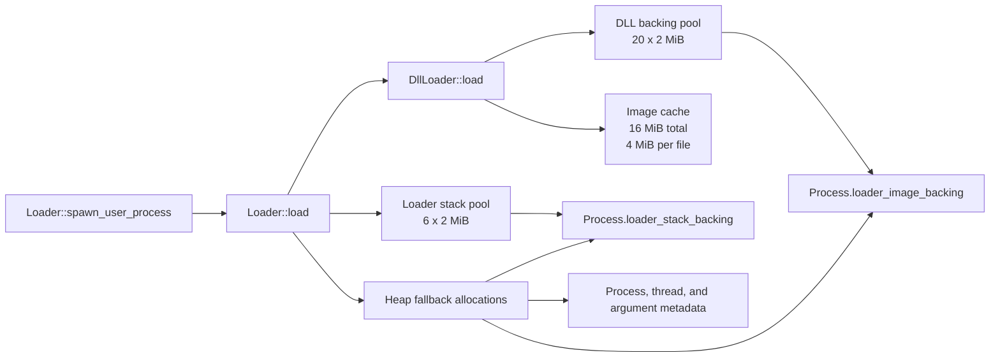
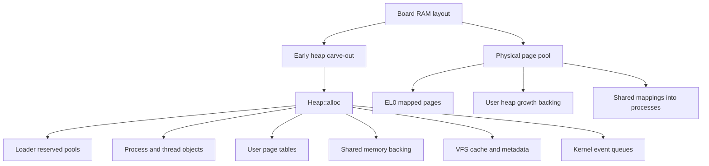
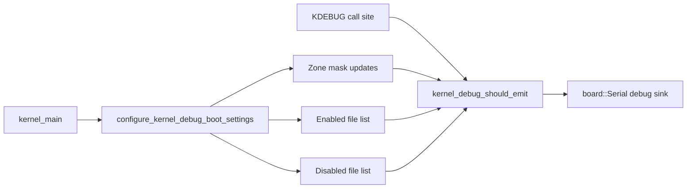

# Loader, Resource Pools, and Boot Switchboard

## What the loader is using

The kernel loader is not backed by a separate virtual-memory-grown loader heap. It allocates from the normal kernel early heap managed by `Heap::alloc()`.

That early heap is board-defined and fixed at boot:

- `virt`: `EarlyHeapSize = 0x06000000` = 96 MiB
- `raspi3`: `EarlyHeapSize = 0x04000000` = 64 MiB

The loader still keeps a few dedicated sub-pools to avoid fragmenting that heap with large aligned allocations:

- Loader stack pool in `kernel/loader/loader.cpp`: `6` slots, each one `L2BlockSize` = `2 MiB`
- DLL backing pool in `kernel/loader/dll_loader.cpp`: `20` slots, each one `2 MiB`
- DLL module table in `kernel/loader/dll_loader.cpp`: `32` loaded user modules tracked at once
- DLL image cache in `kernel/loader/dll_loader.cpp`: `16 MiB` total, `4 MiB` max per cached file, `5 minutes` TTL

Why the loader uses the kernel heap:

- User EXE and DLL payload sizes are not fixed.
- Page tables, process objects, thread objects, launch argument buffers, image cache records, and fallback aligned image blocks all have dynamic lifetime.
- The kernel must retain ownership after load so teardown can free the same backing when the process exits.

What it does not do:

- The kernel does not grow its own heap by extending a kernel VM region map on demand.
- The heap is a fixed carve-out chosen by the board memory layout.
- Per-process user heaps do grow dynamically, but that happens in `kernel/user_heap.cpp` by allocating more backing and mapping new EL0 regions, not by extending the kernel heap.

## Pool inventory

| Subsystem | Capacity / Limit | Backing | Main consumers |
| --- | --- | --- | --- |
| Kernel early heap | 96 MiB on `virt`, 64 MiB on `raspi3` | Fixed board carve-out | Loader fallback blocks, process/thread objects, VFS cache metadata, shared memory backing, page tables, event queues, GUI metadata |
| Physical page pool | All RAM after early heap and page metadata | Board RAM map | User mappings, anonymous pages, shared EL0 mappings |
| Loader stack pool | 6 x 2 MiB | Kernel heap, reserved early | User process main stacks |
| DLL backing pool | 20 x 2 MiB | Kernel heap, reserved early | EXE and DLL image backing |
| DLL loaded-module table | 32 modules | Heap records | One process module graph |
| DLL image cache | 16 MiB total, 4 MiB per file | Kernel heap | Hot DLL and EXE file contents |
| User heap region growth | 256 KiB default region chunks | Kernel heap metadata + mapped backing | EL0 malloc/new callers |
| Shared memory views | 32 view slots per process | User VA slots at fixed EL0 window | Named shared mappings |
| Shared memory object size | Up to 2 MiB per named object | Kernel heap backing, EL0 mapped | GWES/shared data channels |
| Scheduler ready queues | 32 priorities | Intrusive thread links | Runnable threads |
| Thread kernel stacks | 16 KiB per thread | Kernel heap | Kernel threads and user exception stacks |
| Kernel event queue | 16 records initial, doubles on demand | Kernel heap | Event subscribers |
| Device registry | 32 devices, 32 drivers | Fixed arrays | Platform device bring-up |
| VFS mount letters | 26 | Fixed array | Mounted volumes |
| VFS device aliases | 32 | Fixed array | `SERIAL`, `FRAMEBUFFER`, aliases |
| VFS file cache | 32 entries, 24 MiB total, 4 MiB per file | Kernel heap | Cached filesystem reads |
| GUI shared input | 8 consumers, 64 events | One shared page + fixed ring | GWES and client readers |
| GUI window surfaces | 2048 slot units, 64 KiB per unit | Reserved GUI mapping region | Window backing stores |

## Loader path

## Kernel memory model

## Boot switchboard

The boot-time switchboard now lives in `kernel/main.cpp` in two places:

- `g_kernel_boot_test_config`: enables or skips each smoke suite from one table
- `configure_kernel_debug_boot_settings()`: applies zone masks plus source-file allow and deny lists

Default behavior:

- All smoke suites are enabled.
- File-scoped debug suppression is enabled for `heap.cpp`, `mm.cpp`, and `gui_service.cpp` so the new runtime trace hooks preserve the old quiet boot by default.

To focus on one noisy subsystem during bring-up:

1. Flip the matching test flag in `g_kernel_boot_test_config` if you want to skip unrelated suites.
2. Remove the file from the deny list or add it to the allow list.
3. Enable the matching zone bit if that zone is currently masked off.

## Debug routing

## Boot test coverage

The kernel boot harness now has independent switches for:

- heap
- process manager
- memory map metadata
- physical memory manager
- virtual memory manager
- kernel input path
- kernel output path
- kernel event broker
- shared memory manager
- thread manager
- scheduler suite
- platform probes
- VFS namespace smoke

The virtual-memory smoke now does two things:

- runs the existing `MemoryManager::self_test()` snapshot
- creates a temporary user address space, maps one page, unmaps it, and confirms the page watermark returns to baseline

The source-file debug filter is now part of the normal `KDEBUG` path, so heap/MMU/GUI traces can be turned on at runtime from the boot config block instead of restoring compile-time `DEBUG_ENABLE_*` switches.